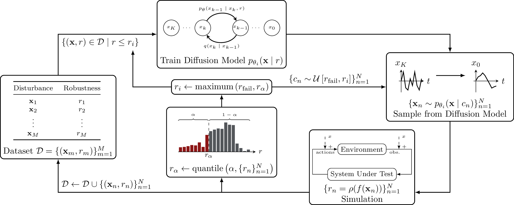

# DiFS - Diffusion-Based Failure Sampling

Sample high-dimensional, multimodal failure trajectories in cyber-physical systems by iteratively training a conditional denoising diffusion model proposal distribution.


The algorithmic details can be seen in this diagram:



## Installation
```
git clone git@github.com:sisl/DiFS.git && cd DiFS
pip install .
```


## Interface
The DiFS trainer expects users to define an *evaluation function* and a tensor of *initial disturbances*.

The evaluation function should follow the following interface:

```python
def evaluate(x):
    """
    Example evaluation function.

    Takes as input a batch of disturbance trajectories as a torch tensor.
    Simulates the system under test with each sample in the batch.
    Returns a tuple of tensors, where the first contains robustness for each
     sample, and the second contains state trajectories.
    
    Failure corresponds to a robustness of 0.
    
    State trajectories are used for logging purposes only.

    Args:
        x (torch.Tensor): The input tensor of shape (batch_size, xdim, horizon).

    Returns:
        torch.Tensor: The robustness associated with each sample,
            shape (batch_size,).
        torch.Tensor: The state trajectories associated with each disturbance,
            shape (batch_size, sdim, horizon).
                      

    """
    # Your code here
```

The initial disturbances should be a torch tensor the same shape as input to `evaluate`. In practice, these are often sampled from a prior distribution designed by the user.

## Example usage
See the `/examples` folder for example usage.
